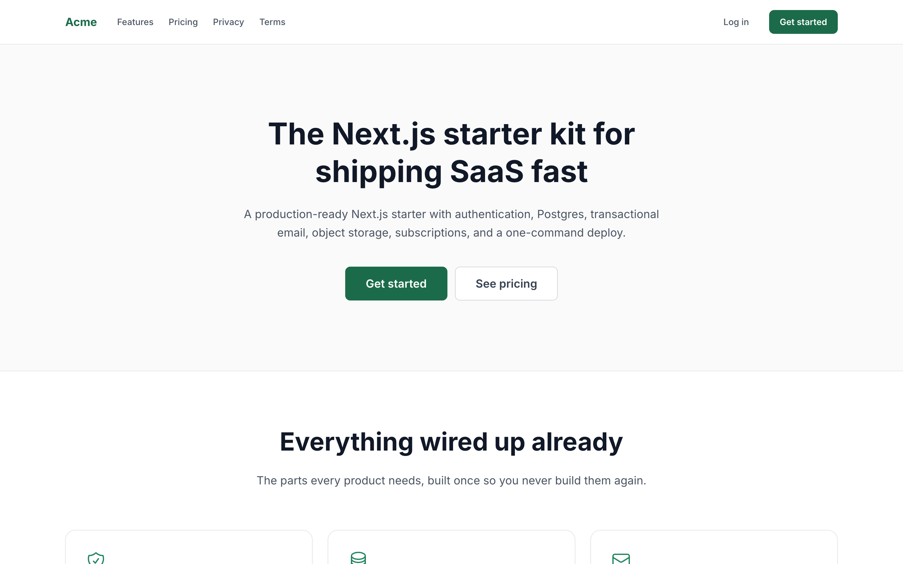
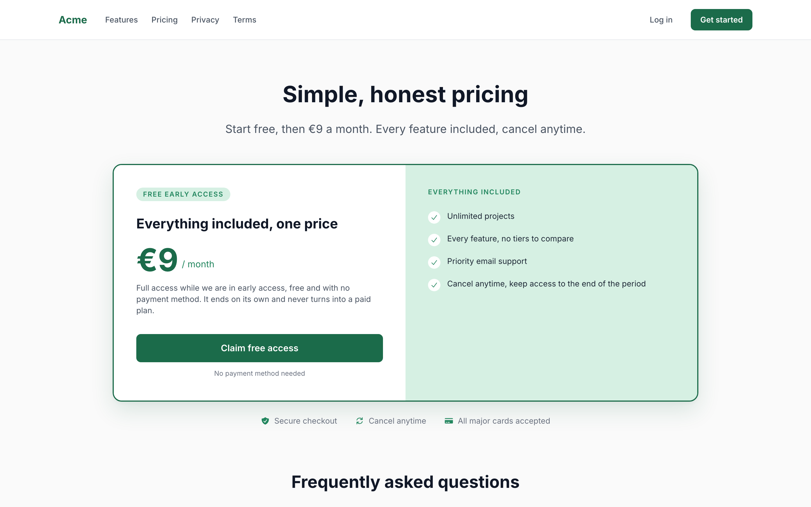
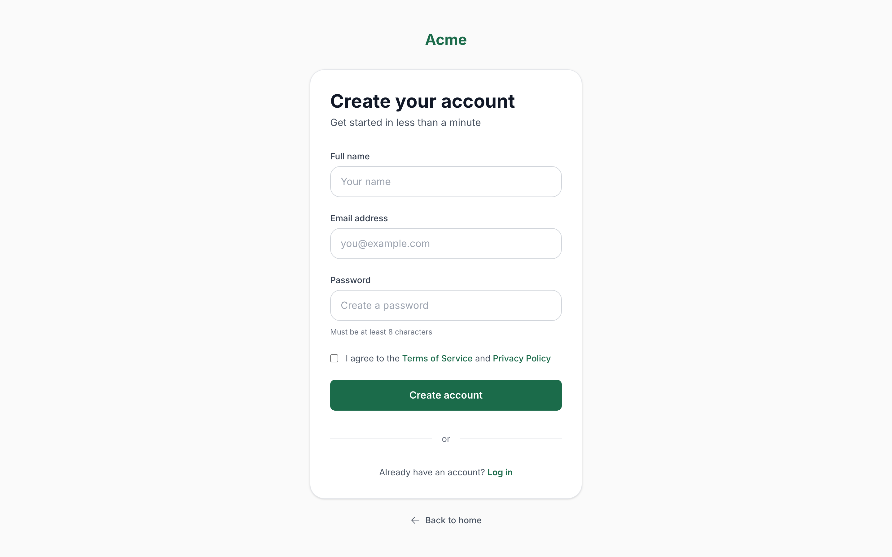

# Next.js Starter Kit

**Stop rebuilding login, billing, and deploys. Start on the part that is actually yours.**

A complete, self-hosted SaaS foundation: authentication, Postgres, transactional email, object storage, subscriptions, GDPR-compliant analytics, and a one-command deploy to a server you own.

[](https://github.com/RashadAnsari/nextjs-starter-kit/actions/workflows/build.yml)
[](LICENSE)




|                                               |                                         |
| --------------------------------------------- | --------------------------------------- |
|  |  |

Everything above is in the repository and runs on a fresh clone, before you write a line of code.

## Why this one

Most starter kits ask you to pick a side: pay a few hundred euros for a closed template, or accept a stack welded to one vendor's hosting, database, and auth.

This one is neither.

- **It is yours.** MIT, free, no licence key, no attribution. Fork it and never think about it again.
- **No vendor lock-in.** Postgres over the plain `pg` driver, S3-compatible storage, any SMTP relay, and a billing interface with one provider implemented behind it. Every piece is swappable because nothing is welded to a platform SDK.
- **It deploys to your own server.** A Docker build, GitHub Actions, and Ansible playbooks put the app and its database on a machine you control, with automated backups to object storage. No per-seat platform bill that grows with your success.
- **You can read all of it.** Plain Next.js, plain SQL, and a thin repository layer. No generated code, no hidden framework, and few enough lines to review end to end in an afternoon.
- **The security details are already right.** Webhook replay protection, redirect validation, per-user storage prefixes, a real CSP, and consent-gated analytics. These are the parts that are easy to get subtly wrong and expensive to discover late, so there is a [test suite](docs/TECHNICAL.md#testing) holding them in place.

### Who it is for

Someone starting a subscription product who wants to own their infrastructure, and who would rather adapt readable code than configure someone else's abstraction.

**Probably not for you if** you want a one-click hosted platform, a drag-and-drop admin panel, or a kit that picks a UI component library for you. This deliberately ships primitives, not a design system.

## What's inside

| Area          | What you get                                                                                                     |
| ------------- | ---------------------------------------------------------------------------------------------------------------- |
| **Framework** | Next.js 16 (App Router), React 19, TypeScript, Tailwind CSS 4                                                    |
| **Auth**      | Better Auth with email and password, required email verification, password reset, session-aware route protection |
| **Database**  | Postgres over `pg`, a repository layer, and a migration runner for plain SQL files                               |
| **Email**     | SMTP through nodemailer, with branded HTML templates                                                             |
| **Payments**  | Provider-agnostic billing interface, Paddle implemented, signed webhooks with replay protection                  |
| **Storage**   | S3-compatible uploads, per-user key prefixes, short-lived signed URLs                                            |
| **Analytics** | Google Analytics 4 that loads only after consent, plus a GDPR-compliant consent banner                           |
| **Security**  | CSP and security headers, safe post-auth redirects, webhook idempotency                                          |
| **Pages**     | Landing, pricing, dashboard, settings, auth flows, 404, and privacy/terms/refund policies                        |
| **Tests**     | 97 tests over the money and access paths, run by `make test` and in CI                                           |
| **Ops**       | Docker build, GitHub Actions, Ansible playbooks, automated database backups to object storage                    |

## Quick start

```bash
git clone https://github.com/RashadAnsari/nextjs-starter-kit.git my-app
cd my-app
rm -rf .git && git init        # start your own history
```

Then:

```bash
bun install
cp .env.example .env.local     # then fill in the required values
make up                        # local Postgres on port 5432
make migrate                   # apply db/migrations
make dev                       # http://localhost:3000
```

The only values you need to get running are `DATABASE_URL` (already correct for the bundled compose file), `BETTER_AUTH_SECRET`, and SMTP credentials so verification emails can be delivered. Everything else is optional: with `PAYMENT_PROVIDER` empty the app grants each new user three months of free access, so the whole signup-to-dashboard path works before you set up billing.

Generate the auth secret with:

```bash
openssl rand -base64 32
```

## Documentation

The [technical guide](docs/TECHNICAL.md) covers the rest: what to change to make it yours, how each piece works and why, and how to test and deploy it.

| Section                                                      | What it answers                                                         |
| ------------------------------------------------------------ | ----------------------------------------------------------------------- |
| [Make it yours](docs/TECHNICAL.md#make-it-yours)             | Renaming, colours, icons, plan, legal pages, and what is safe to delete |
| [Project layout](docs/TECHNICAL.md#project-layout)           | Where everything lives                                                  |
| [How the pieces work](docs/TECHNICAL.md#how-the-pieces-work) | Auth, database, email, payments, storage, consent, SEO, env vars, CSP   |
| [Testing](docs/TECHNICAL.md#testing)                         | What is covered, what is deliberately not, and the pattern to copy      |
| [Deployment](docs/TECHNICAL.md#deployment)                   | The two compose stacks, the playbooks, and database backups             |
| [Commands](docs/TECHNICAL.md#commands)                       | Every `make` target                                                     |

## Contributing

Fixes, dependency bumps, and documentation that saves someone an hour are all welcome. See [CONTRIBUTING.md](CONTRIBUTING.md) for what is in scope and the checks a pull request has to pass. Read [AGENTS.md](AGENTS.md) first: it carries the conventions this codebase actually follows.

Found a security issue? Please do not open a public issue. Use [private vulnerability reporting](https://github.com/RashadAnsari/nextjs-starter-kit/security/advisories/new) on the Security tab instead.

## License

[MIT](LICENSE). Use it for anything, including commercial work, with no attribution required.

If it saved you a weekend, a star costs nothing and helps other people find it.
